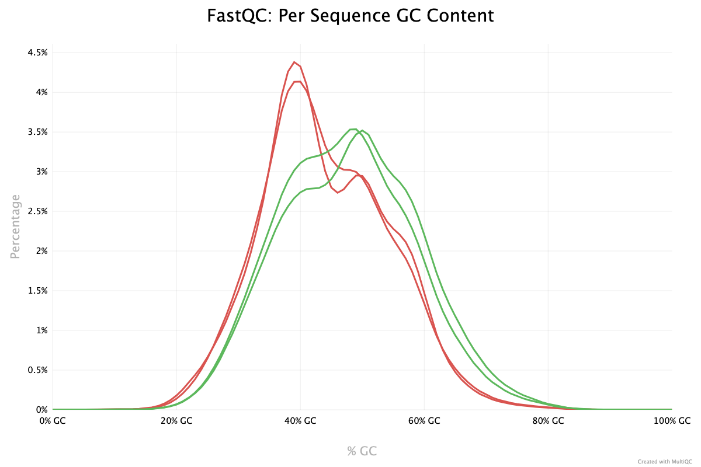
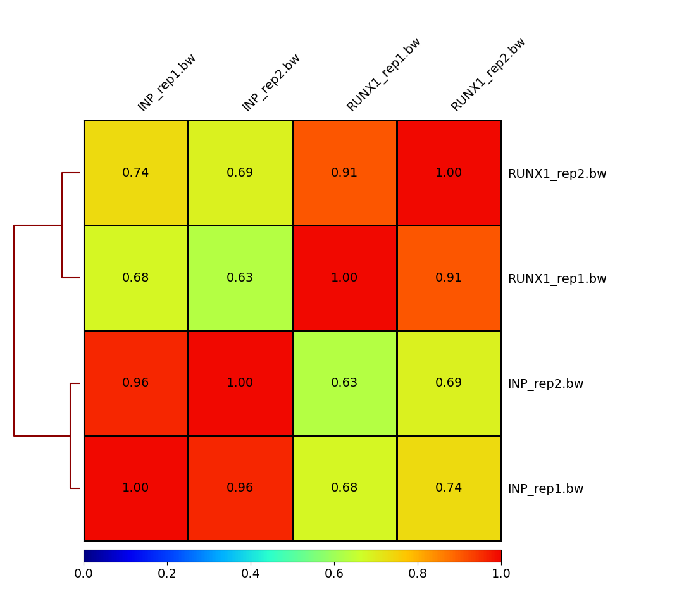
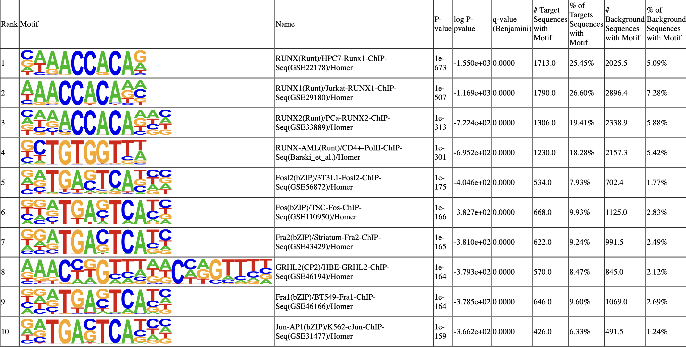
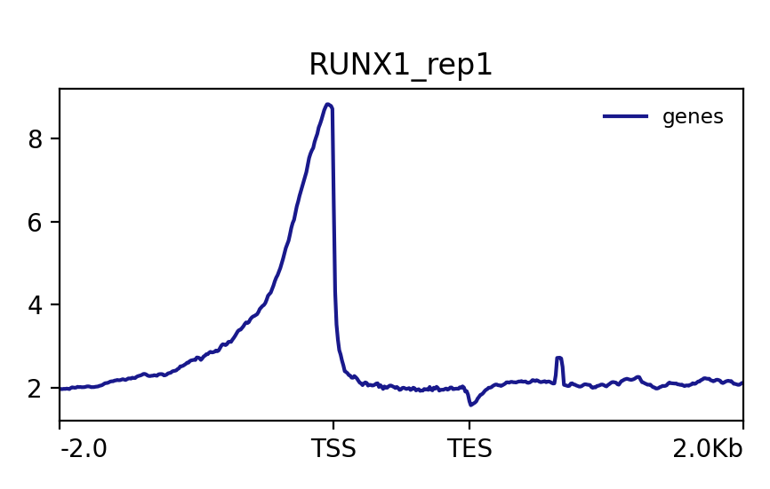
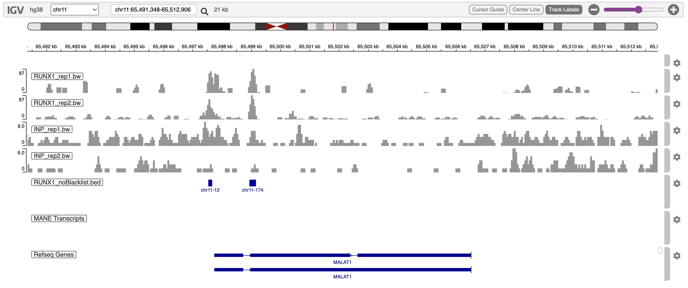

Please take some time and answer the following questions. You'll notice that
some questions are more theoretical and may require you to do a little research.
Feel free to also discuss with your classmates. After submission, we will
provide you feedback and allow you to resubmit. We will also go through the
questions together during class after resubmission.


**Methods and Quality Control**

1. Include a full methods section for this project. You may simply combine
the individual methods sections you've written for each week.

Raw sequencing reads can be obtained via GEO Accession [GSE75070](https://www.ncbi.nlm.nih.gov/geo/query/acc.cgi?acc=GSE75070).

Raw sequencing reads were first inspected for quality assessment using [FastQC v0.12.1](https://qubeshub.org/resources/fastqc).

The raw reads were then quality controlled with [Trimmomatic v0.39](http://www.usadellab.org/cms/?page=trimmomatic) using the arguments 'ILLUMINACLIP:TruSeq3-SE.fa:2:30:10 LEADING:3 TRAILING:3 SLIDINGWINDOW:4:15'. 

[Bowtie2 v2.5.3](https://bowtie-bio.sourceforge.net/bowtie2/index.shtml) `build` was used to build a genome index for human genome GRCh38

Post trimmomatic raw reads were then aligned to the generated reference using Bowtie2 as well.

Quality assessment for these alignments was performed using [Samtools v1.19.2](https://www.htslib.org/) `flagstat`to check for alignment quality. 

[MultiQC v1.20](https://multiqc.info/) was used to generate an overall quality report combining samtools flagstat and FastQC reports and can be found on the github repo https://github.com/BF528/project-2-John2018330.

Samtools was used to sorted and index the BAM's and then converted into bigwig files using [DeepTools  v](https://deeptools.readthedocs.io/en/develop/#) `bamCoverage`. 

A clustered Heatmap for the four samples was generated by DeepTools `multiBigWigSummary` and then `plotCorrelation` using `-c 'pearson' --plotNumbers --skipZeros`. The heatmap can be found below in section (...).

[HOMER v4.11](http://homer.ucsd.edu/homer/) was the primary software used for peak calling.

For each repliate of RUNX1 immunoprecipitation, HOMER `findPeaks` was used in conjunction with the non-enrichment sample (INP) with flags `-style factor -o auto`.

HOMER `pos2bed.pl` was used to turn the outputted peaks file to bed format.

[Bedtools v2.31.1](https://bedtools.readthedocs.io/en/latest/) `intersect` was first used with default flags to generate a list of reproducible peaks across the two RUNX1 replicates.

It was then used in conjunction with a file containing blacklisted regions with flag `-v` to remove known signal-artifact regions from the list of reproducible peaks.

HOMER `annotatePeaks.pl` was used to annotate peaks by providing both the GRCh38 primary assembly human genome and corresponding annotation gtf file.

HOMER `findMotifsGenome.pl` was used with default parameters to perform motif enrichment analysis with default parameters.

DeepTools `compute_matrix` was used to generate matrices of scores of peaks that fall into +/- 2kb regions  of interest defined by the HG38 annotation file using flags `-b 2000 -a 2000`.

DeepTools `plotProfile` was used to generate visualizations for both RUNX1 replicates showing signal coverage averaged across the body of all genes.

We combined differentially expressed genes identified via RNA-Seq analyses using DESeq2 with annotated peaks generated by HOMER to create figure 2F. 


2. Examine the figure provided below:
```{r, dup rate}
knitr::include_graphics("fastqc_sequence_counts_plot.png")
```
Notice the duplication rates between the IP (Runx1) and Input control samples.
Provide an explanation for why they are so different. Also make sure to note
whether you think this represents an issue with the dataset, and if so, why?.

The idea behind ChIP Seq is to target regions of the DNA that are captured by a specific DNA binding protein, which in this experiment is RUNX1.
In essence, the ImmunoPrecipitation replicates in this experiment should contain a large portion of DNA fragments that have the RUNX1 protein bound to it.
In other words, a large portion of the DNA fragments captured in the IP replicates should be 'duplicates' as we are capturing DNA sequences with very high similarity.
This is observed in the RUNX1_rep1 and rep2 bars in the plot above.
The Input Control replicates (INP) are not enriched for any particular DNA bound protein, so the sequences that are captured will be much more diverse and effectively random.
This is the reasoning behind the large disparity of duplicate reads in IP vs INP replicates, and is also not a concern for this dataset.

JOEY'S ANSWER: we are enriching for runx1 sites, probably have similar motifs, expect them to be similar. we are sequencing a smaller amount of the genome because we are targeting only the parts where runx1 is bound (smaller input DNA leads to more PCR duplicates?)


3. Examine the figure provided below:
```{r, GC content}

```
Consider the GC plot for the IP and Input control samples. The two input samples
are represented by the red distributions, and the IP samples are the green
distributions.

Why do you think we see a difference in the GC distribution between our IP and
Input control samples? Also make sure to note whether you think this represents
an issue with the dataset and if so, why?

The small difference in the distribution of GC content in reads in IP vs INP stems from the same discussion about duplicate reads above.
The sequences from the IP replicates are highly enriched for the sequence that the RUNX1 protein binds to, whereas the sequences in the INP replicates are effectively random.
If the sequence that RUNX1 binds to happens to have a higher GC content or is frequently flanked by regions with slightly higher GC content (green curve), then the distribution of reads with x%
GC content will be inflated compared to the rest of the reads from the genome (red curve).
Regardless, the difference in the distribution observed is not an issue.

JOEYS ANSWER: very similar to previous questions, the IP represents only RUNX1 binding sites


**Thought Questions on Publication**

The following questions will reference the original publication, which can be
found here: https://www.ncbi.nlm.nih.gov/pmc/articles/PMC5071180/

3. First, please report the following results:
  
A. How many peaks were called in each of the biological replicates in your
results?

In replicate 1: 97336 peaks
In replicate 2: 24166 peaks

JOEY'S ANSWER: these numbers were very different from paper

  
B. How many "reproducible" peaks did you end up with after applying your
bedtools intersect strategy on the two replicate peak sets?
     
We found 6762 reproducible peaks

JOEY'S ANSWER:      
     
C. How many "reproducible" peaks remained after filtering out any peaks found in
the hg38 blacklisted regions?
     
After filtering out the blacklisted regions, we were left with 6730 peaks.


Consider Supplementary Figure S2C, do you obtain the same number of Runx1
peaks for each replicate experiment? Do you obtain the same number of
reproducible peaks? If not, provide at least three reasons why your results
differ.

The numbers across the board are very different. 
The peaks called within each biological replicate in our experiment is significantly higher than the numbers reported in Figure S2C (97K to 4k, 24k to 10k).
The reproducible peaks called in our experiment were also higher: 6762 reproducible peaks compared to their reported 3466. 

A number of reasons could be responsible for this discrepancy.
Firstly, a number of resources and software have been updated since this study was performed.
One of these includes the human reference genome itself and it's corresponding annotations.
While the analyses performed in the paper likely used the most up-to-date reference at the time, hg19, whereas we are performing these analyses with hg38.

Secondly, the methods section of the article does not go into details about how each software was run and specific arguments or flags that were being used.
Thirdly, the versions of the software have likely been updated since they were ran for this analysis.
Differences in not only the way that the software is run but also the version of the software (again there was roughly 8 year difference) can contribute to the observed discrepancy.


4. Consider figure 2a, notice that around 1/3 of all of their reported
reproducible peaks are annotated to intergenic regions (regions of the genome
not associated with any known genes). Propose at least two experiments (or sets
of experiments) that would help you begin to understand whether these peaks are
biologically relevant.

ATAC-Seq is useful for studying regions of open chromatin (intergenic regions). 
If we assume that regions of open chromatin that are differnetially expressed play a role in the regulation of genes, then an ATAC-Seq experiment may help see which of the intergenic peaks in the ChIP-Seq experiment have biological relevance

Another experiment that can be combined with this information is experiments that look at methylation patterns or other proteins involved with chromatin remodeling (H3K4me1, p300-CPB, H3K27 acetylation, etc.). 
One of the key ideas about these experiments is that changes in chromatin environment are related to changes in gene regulation.
If we were to perform an experiment comparing two different states of the study system (like knockdown), observed changes in chromatin environment can be attributed to the different states.


JOEY ANSWER: overlay with other histone marks, could knockout genes; unannotated peaks are hard to deal with, try to isolate them and search for motifs or see if there is overlap with any enhancer markers or histone markers


5. Consider figure 2f, note that many of the genes that are differentially
expressed upon Runx1 knockdown do **not** have a proximal Runx1 binding peak.
Provide at least three reasons for why this might be the case.

Gene regulation is complex and there are many reasons why this may be true.

Firstly, it is known that regulatory components (involving DNA) in the human genome do not necessarily have to be physically close to the regulation target. 
Distal regulation involves regulatory complexes that may bind hundreds of kb up or downstream the regulatory target, and this may be true in a number of the cases here.

Another reason may be that a knockdown of RUNX1 has downstream regulatory effects that RUNX1 is involved with.
As a crude example, if RUNX1 is a TF that promotes the production of other regulatory elements, than a knockdown of RUNX1 may affect the regulation of those regulatory element's targets.

Thirdly, the knockdown of a transcription factor may lead cells to undergo a number of major changes. 
These downstream cascading changes maybeunrelated to the targeted genes of RUNX1, and thus do not have a proximal RUNX1 binding peak.


joey answer: 

**Reporting your results**

For the next section, please include the requested figures you generated from
your workflow. For results that are not already a plot / image file, take a
quick screenshot and include it here. Make sure you push these images to this
github classroom repo and include the name / path in the
knitr::include_graphics() function provided. 

Please display your correlation plot displaying the overall similarity between
your sample files based on the read coverage scores across genomic regions:
```{r, correlation heatmap from plotCorrelation}

```

Please include a screenshot of the top ten results from the knownResults output
from motif finding with HOMER findMotifsGenome:
```{r, motif results from findMotifsGenome}

```

Please include the signal coverage plot you generated in week 4. This is the 
output of plotProfile that shows the density of Runx1 binding across all of the
hg38 gene bodies. You only need to show one representative plot:
```{r, signal coverage plots from plotProfile}

```


Please include one of the screenshots of the genome browser view of either the
MALAT1 or NEAT1 locus with your bigWig files and BED file. You only need to
include one:
```{r, NEAT1 or MALAT1 genome browser view with tracks}

```
